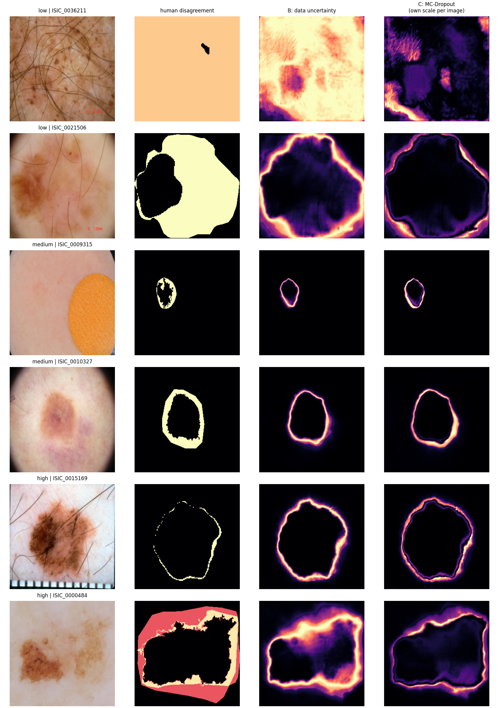
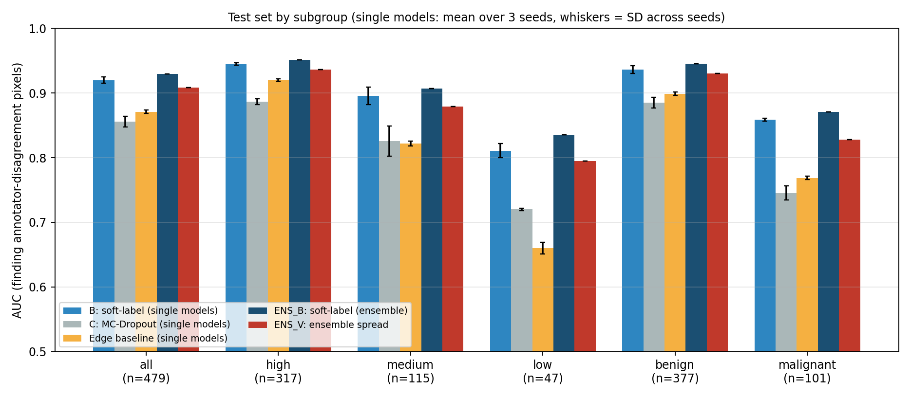
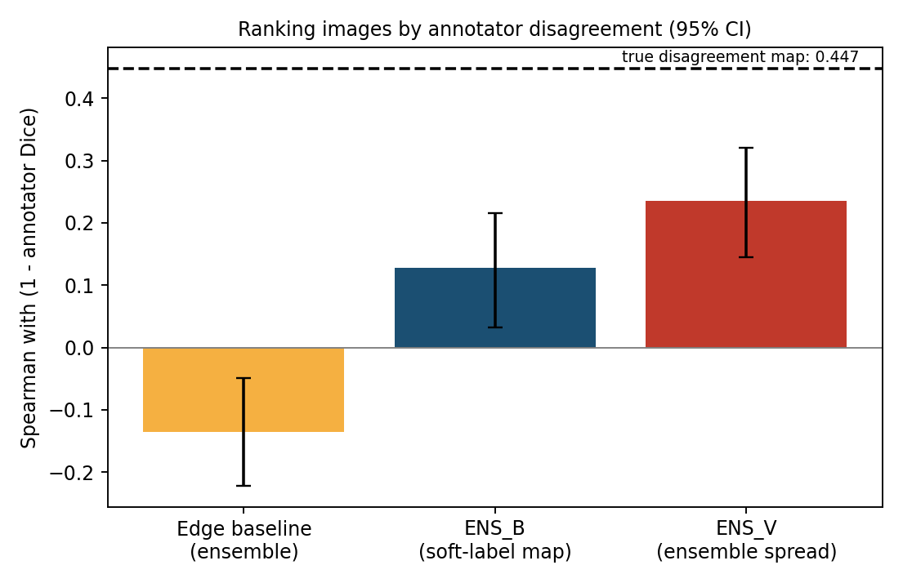

# Uncertainty Maps and Agreement Prediction for Annotator Disagreement in Skin Lesion Segmentation

When several doctors outline the same skin lesion, their outlines differ, mostly along fuzzy borders. Standard segmentation models are trained on a single outline and stay confident where experts disagree.

This project trains a U-Net on **all** available outlines and produces a **pixel-wise uncertainty map** showing where annotators are likely to disagree. A second model predicts, from the photo alone, **how much annotators will disagree on an image**. Both are evaluated on held-out images against the real disagreement between annotators, over three training runs.

*Test examples from one model (seed 42); rows: low, medium and high annotator agreement. Columns: photo, real annotator disagreement, soft-label uncertainty map (B), MC-Dropout map (C, scaled per image).*

## Dataset

[IMA++](https://doi.org/10.5281/zenodo.14201692), the multi-annotator skin lesion segmentation dataset built from the ISIC Archive by Abhishek, Kawahara and Hamarneh (Simon Fraser University).

- Multi-annotator subset: 2,394 images with 2-5 real human outlines each (5,111 outlines). The dataset's consensus masks were excluded.
- Official train / val / test split: 1,675 / 240 / 479 images. Images resized to 256 x 256.
- The official split is stratified but not grouped by patient or lesion. Lesion IDs are known for 793 and patient IDs for 770 of the 2,394 images; among the test images with a known ID, 29 of 177 share a lesion and 50 of 165 share a patient with a training image. A robustness check is reported below.

Please cite the dataset using the citation information in its repository: https://github.com/sfu-mial/IMAplusplus. The data is not included here.

## Method

- **Segmentation model:** U-Net with an ImageNet-pretrained ResNet34 encoder and `Dropout2d(0.25)` before the final layer. Target: soft label = mean of the real outlines. Loss: BCE + soft Dice. Adam (lr 1e-4), batch size 16, 30 epochs, three seeds (42, 1, 2), best epoch per seed chosen on validation loss.
- **Maps compared on the test images:**
  - **B:** `p(1 - p)` from the predicted probability.
  - **C, MC-Dropout:** per-pixel variance over 16 stochastic passes.
  - **Edge baseline:** a blurred 3 px band around the predicted border.
  - **Deep ensemble of the three models:** **ENS_B** = `p(1 - p)` of the averaged probability; **ENS_V** = per-pixel variance of the probability across the three models.
- **Reference disagreement:** `m(1 - m)`, where `m` is the mean of the real outlines.
- **Agreement predictor:** an ImageNet-pretrained ResNet34 with one output, trained with MSE to predict an image's mean annotator Dice from the photo alone (flips and rotations, Adam lr 1e-4, batch size 32, 20 epochs, three seeds, best epoch chosen on validation Spearman). The predicted disagreement is 1 minus the prediction; the ensemble averages the three models.

## Results (479 test images)

Dice of the prediction against each annotator's outline: 0.852 ± 0.001 over the 3 seeds (ensemble 0.857). Annotator vs annotator: 0.798, for context only (the model predicts an averaged outline, so the two are not directly comparable).

**1. Where in an image do annotators disagree?** Mean per-image ROC-AUC (0.5 = chance). Columns B, C and Edge: mean ± SD over the 3 seeds.

| Subset | n | B: soft-label | C: MC-Dropout | Edge baseline | ENS_B | ENS_V |
|---|---|---|---|---|---|---|
| All | 479 | 0.920 ± 0.005 | 0.856 ± 0.008 | 0.871 ± 0.002 | **0.929** | 0.909 |
| High agreement | 317 | 0.945 ± 0.002 | 0.887 ± 0.005 | 0.920 ± 0.002 | **0.951** | 0.937 |
| Medium agreement | 115 | 0.895 ± 0.014 | 0.826 ± 0.024 | 0.822 ± 0.004 | **0.907** | 0.879 |
| Low agreement | 47 | 0.811 ± 0.011 | 0.720 ± 0.002 | 0.660 ± 0.009 | **0.836** | 0.795 |
| Benign | 377 | 0.936 ± 0.006 | 0.885 ± 0.008 | 0.899 ± 0.003 | **0.945** | 0.930 |
| Malignant | 101 | 0.859 ± 0.002 | 0.745 ± 0.011 | 0.769 ± 0.002 | **0.871** | 0.828 |

**2. Which images will annotators dispute?** Image-level Spearman correlation between a score and (1 - mean annotator Dice), and AUC for flagging the low-agreement images, with 95% bootstrap confidence intervals.

| Score | Spearman [95% CI] | AUC for low-agreement images [95% CI] |
|---|---|---|
| Photo-only agreement predictor (3 models averaged) | **0.638** [0.573, 0.700] | **0.860** [0.806, 0.906] |
| Photo-only predictor, single models (seeds 42 / 1 / 2) | 0.616 / 0.589 / 0.622 | 0.842 / 0.841 / 0.853 |
| ENS_V (spread across the 3 segmentation models) | 0.235 [0.145, 0.321] | 0.757 [0.672, 0.833] |
| ENS_B (soft-label map, ensemble) | 0.127 [0.032, 0.216] | 0.707 [0.616, 0.794] |
| Edge baseline (ensemble) | -0.135 [-0.222, -0.049] | 0.519 [0.433, 0.613] |

Predictor minus ENS_V (Spearman): +0.403 [+0.306, +0.503].

**3. Robustness to patients and lesions shared with the training set.** The same test results, restricted to test images without a known shared lesion or patient:

| Test subset | n | Predictor Spearman | ENS_V Spearman | Predictor AUC (low agreement) | B minus edge baseline (AUC) |
|---|---|---|---|---|---|
| All test images | 479 | 0.638 [0.573, 0.700] | 0.235 [0.145, 0.321] | 0.860 [0.806, 0.906] | +0.049 [+0.041, +0.056] |
| Without a known shared lesion/patient | 428 | 0.617 [0.546, 0.679] | 0.198 [0.097, 0.291] | 0.855 [0.795, 0.910] | +0.046 [+0.038, +0.054] |
| Only images with known IDs and no overlap | 172 | 0.651 [0.547, 0.735] | 0.390 [0.253, 0.510] | 0.817 [0.735, 0.886] | +0.066 [+0.052, +0.080] |

The last row is a different, smaller population (29 low-agreement images), so its values should not be compared directly with the other rows.

## Findings

- **Within an image**, the soft-label map (B) had a higher AUC than both the edge baseline and MC-Dropout in every seed and every subset. Its advantage over the edge baseline is small on high-agreement images (0.945 vs 0.920) and large on low-agreement (0.811 vs 0.660) and malignant (0.859 vs 0.769) images. A three-model ensemble improves it slightly but consistently (+0.010 AUC).
- MC-Dropout scored below the edge baseline on average (0.856 vs 0.871), but not in every case; dropout was tested in one location only.
- **Across images**, a model that sees only the photo ranked images by annotator disagreement much better than uncertainty derived from the segmentation models (Spearman 0.638 vs 0.235). The segmentation-based scores are weak by comparison, and the soft-label score (ENS_B) is not distinguishable from zero once images with a known shared patient or lesion are removed (0.091 [-0.011, 0.190]).
- The predictor's result is similar after removing test images that share a known patient or lesion with the training set.

## Limitations

- Only three training runs per model; subgroup numbers (47 low-agreement and 101 malignant test images) are noisy. Confidence intervals cover the choice of test images, not training randomness.
- Lesion and patient IDs are known for only about a third of the images, so overlap between training and test images without IDs cannot be checked.
- The agreement predictor shows that disagreement can be predicted from the photo; it does not show why. It may use lesion characteristics or image-source cues that go with particular annotators or tools.
- The test set was evaluated several times: the seed-42 results were seen first; the three-seed, ensemble, predictor and robustness analyses were then specified in advance and run without changing any setting. Treat the test results as exploratory.
- No hyperparameter search; 256 x 256 resolution; edge-band width and the number of epochs fixed in advance.
- When one annotator marks a very different region (e.g. `ISIC_0021506`), the maps highlight the model's own border and miss much of the disagreement.
- Research prototype, not a clinical tool. Related work on this dataset exists (e.g. ensembles trained from multiple annotations, and image-based prediction of annotator agreement); no novelty is claimed.

## Reproduce

1. Download `segs.zip` and the CSV files from [Zenodo](https://doi.org/10.5281/zenodo.14201692) into a Google Drive folder named `IMA_project`.
2. Run `notebooks/01_data_preparation.ipynb`. It downloads the 2,394 images through the ISIC API and builds `ima_256.npz`.
3. Run `notebooks/02_train_and_evaluate.ipynb` (training, evaluation, robustness check and figures; about 27 minutes per segmentation model on a free Colab T4 GPU).

Requirements are listed in `requirements.txt`. Result tables are in `results/` and figures in `figures/`.
